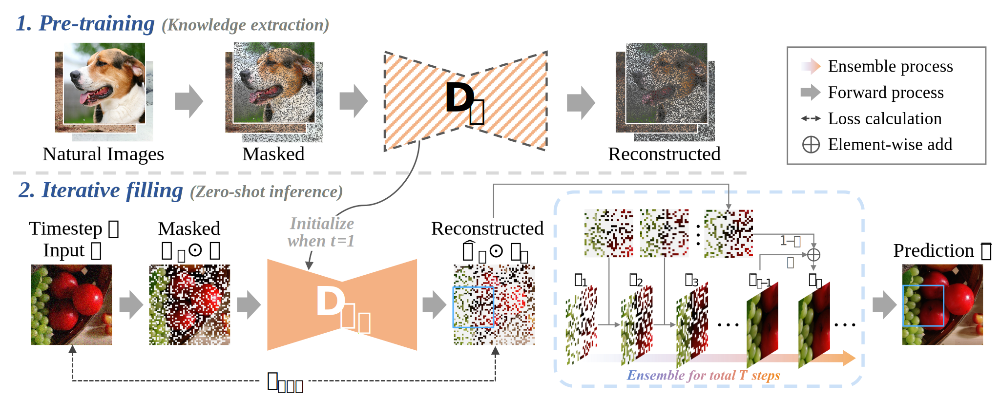
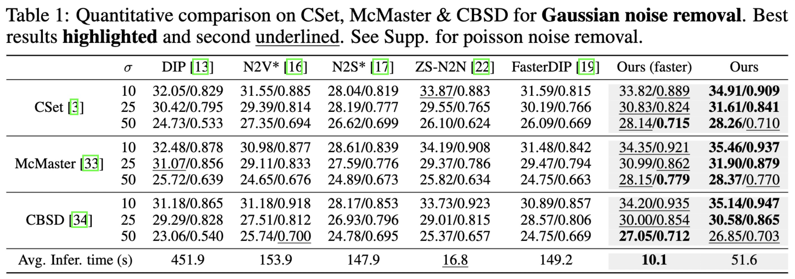
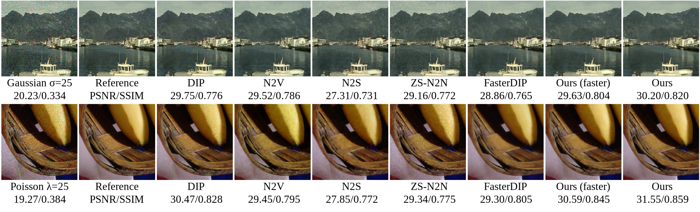
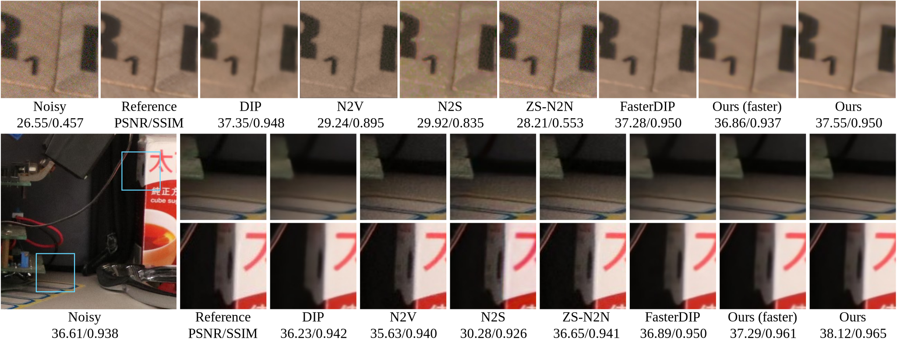

# Masked Pre-training Enables Universal Zero-shot Denoiser

Official PyTorch implementation of ["Masked Pre-training Model Enables Universal Zero-shot Denoiser"](https://arxiv.org/abs/2401.14966) in NeurIPS 2024.




## Abstract
In this work, we observe that model trained on vast general images via masking strategy, has been naturally embedded with their distribution knowledge, thus spontaneously attains the underlying potential for strong image denoising.
Based on this observation, we propose a novel zero-shot denoising paradigm, i.e., Masked Pre-train then Iterative fill MPI.
MPI first trains model via masking and then employs pre-trained weight for high-quality zero-shot image denoising on a single noisy image.
Concretely, MPI comprises two key procedures:
1) Masked Pre-training involves training model to reconstruct massive natural images with random masking for generalizable representations, gathering the potential for valid zero-shot denoising on images with varying noise degradation and even in distinct image types.
2) Iterative filling exploits pre-trained knowledge for effective zero-shot denoising. It iteratively optimizes the image by leveraging pre-trained weights, focusing on alternate reconstruction of different image parts, and gradually assembles fully denoised image within limited number of iterations.
Comprehensive experiments across various noisy scenarios underscore the notable advances of MPI over previous approaches with a marked reduction in inference time.


---

## Setup

### Requirements

Our experiments are done with:

- python = 3.9.16
- pytorch = 1.12.1+cu113
- numpy = 1.25.0
- matplotlib = 3.7.1
- scikit-image = 0.21.0
- jupyter

## For Pre-train
We choose 48,627 images from ImageNet validation dataset

* First, download "ILSVRC2012_img_val.tar" from https://www.image-net.org/, and unzip
* Then select images with shape larger than 256×256 using ``./training_codes/data_gen.py``,
* Your dataset path should be like:

```
ImageNet
├── ILSVRC2012_val_00000001.JPEG
├── ILSVRC2012_val_00000002.JPEG
└── ...
```


* Cd into ./training_codes, and then run:
```
python -m torch.distributed.launch --nproc_per_node=8 --master_port=4321 basicsr/train.py -opt options/train/Fill_skip_imagenet_m_syn.yml --launcher pytorch
```

* Then the last checkpoint net_g_latest.pth can be found in ./experiments

* Copy the checkpoint for zero-shot inference


## For Evaluation

* For evaluation on synthetic noise, run ``eval_syn.py``

* For evaluation on real-world images, run ``eval_real.py``

* For evaluation on SIDD & DND benchmark, cd into eval_benchmarks, run ``sidd_denoise.py`` and ``dnd_denoise.py``

* For a simple test version, run the ``example_denoise.ipynb`` directly (only supported synthetic noise).

Metrics in paper are tested on Nvidia RTX 3090 GPUs

## Results

### Quantitative results

Here is reported results of MPI. Please refer our paper for more detailed results.



With only ~10 seconds to exceed most recent methods!

And can deal with multiple types of noise, refer our paper for more details.

### Qualitative results

Under gaussian noise:


For real-world noisy images:


### More results


## Reference
```
@misc{ma2024maskedpretrainingenablesuniversal,
      title={Masked Pre-training Enables Universal Zero-shot Denoiser}, 
      author={Xiaoxiao Ma and Zhixiang Wei and Yi Jin and Pengyang Ling and Tianle Liu and Ben Wang and Junkang Dai and Huaian Chen},
      year={2024},
      eprint={2401.14966},
      archivePrefix={arXiv},
      primaryClass={cs.CV},
      url={https://arxiv.org/abs/2401.14966}, 
}
```

## Acknowledgement

DIP

BasicSR
<!-- ---

